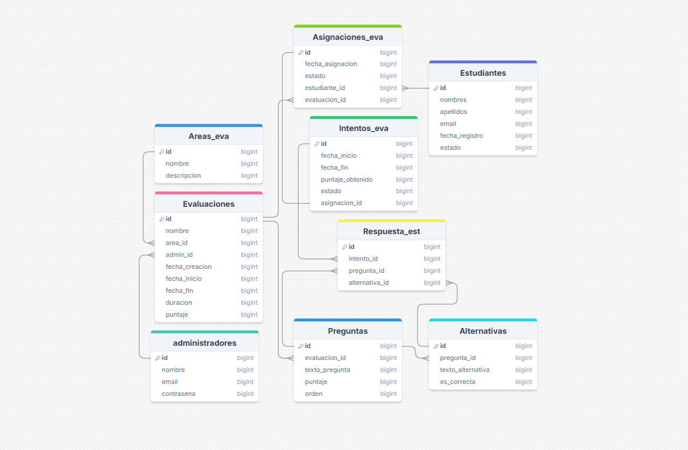

## Resumen del Proyecto

"Aprende Perú" es un sistema de gestión de evaluaciones en línea. Permite a los administradores crear y gestionar evaluaciones por áreas temáticas, definir preguntas con alternativas y puntajes específicos. Los estudiantes pueden registrarse, realizar las evaluaciones asignadas y recibir un puntaje basado en sus respuestas. El sistema registra los intentos de los estudiantes y el estado de cada evaluación.

[Diagrama de la base de datos](https://drawsql.app/teams/senati-15/diagrams/aprende-peru)

